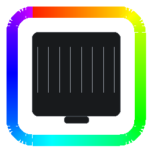

# UIWLED

WLED-style color, effects, and per-jack control for Ubiquiti Etherlighting switches — packaged as a Home Assistant addon plus a native HA integration.



## What it does

Every RJ45 jack on your Ubiquiti Pro Max switch has an RGB LED around it. UniFi's own UI treats them as passive info displays (link speed, PoE, port locate). UIWLED turns them into an addressable LED strip you can drive from Home Assistant — solid colors, animated effects, per-jack overrides, presets, palettes, the works.

- **22+ WLED-style effects** — Solid, Breathe, Rainbow, Chase, Meteor, Fireworks, Pacifica, Sunrise, and many more, running at 5–15 FPS depending on effect type
- **Independent per-switch state** — different color/effect per switch
- **Per-jack override** — pin a single jack to any color while an effect keeps running on the rest (great for alerts, port-locate)
- **Palettes & presets** — 8 built-in palettes, editable custom palettes, named presets per switch
- **Home Assistant integration** — every switch appears as a `light.` entity with RGB + brightness + effect select
- **HA services** — `uiwled.set_port`, `uiwled.clear_port`, `uiwled.clear_all_ports` for scriptable per-jack control

## Supported hardware

- USW Pro Max 16 PoE
- USW Pro Max 24 PoE
- USW Pro Max 48 PoE
- (any USW Pro Max variant with Etherlighting should work — layout tables are trivially extendable)

Requires UniFi firmware 7.4.x or later.

## How it works

1. **On start**, the addon SSHes into each configured switch (creds are the site-wide UniFi SSH user).
2. **Discovers the model** via `mca-cli-op info` and pulls the port layout from a small local table.
3. **Uploads a tiny shell agent** to `/tmp/uiwled_agent.sh` and starts it as a persistent process.
4. **Streams frame commands** over the agent's stdin at the configured FPS (default 15).
5. **Effects run in Go** — an internal ticker computes each frame, diffs against the previous frame, and only pushes changed jacks. Uniform frames use `/proc/led/led_all_port_code` (one write per frame).
6. **HA integration** polls the addon's REST API to expose each switch as a `light.` entity.

## Configuration

In the addon's Configuration tab:

```yaml
switches:
  - name: rack_top       # anything you want, used in HA entity names
    host: 192.168.1.2    # switch IP
    user: admin          # UniFi site-wide SSH user
    password: yourpass   # UniFi site-wide SSH password
    ssh_key: ""          # optional PEM private key instead of password
listen_port: 8080        # web UI + REST
log_level: info          # debug, info, warn, error
target_fps: 15           # 5-20 recommended
```

**SSH credentials** are set in UniFi Network → Settings → System → Advanced → Device SSH Authentication.

## Home Assistant integration

Copy `custom_components/uiwled/` from the `config/` example (or install from HACS once packaged), restart Home Assistant, then:

1. Settings → Devices & Services → Add Integration → **UIWLED**
2. Host: `localhost`, Port: `8080` → Submit
3. Two entities per configured switch appear: one `light.` and the shared `uiwled.*` services

## Performance notes

The per-jack LED bandwidth ceiling of the switch's shell is around **5 FPS for 48-port switches**. Uniform-color effects (Solid, Breathe, Fade) run silky-smooth at 15+ FPS via a single `led_all_port_code` write per frame. If you want higher per-jack framerates you would need to cross-compile a native binary agent.

## Credits

The `/proc/led/*` command language was reverse-engineered by [robherley/etherlighter](https://github.com/robherley/etherlighter). UIWLED reuses that knowledge but is otherwise an independent implementation.

## License

MIT — see LICENSE.
